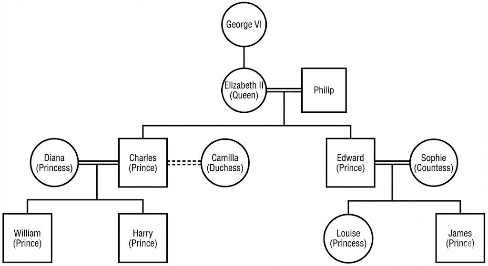

# Family Tree

## Explanation

- George VI is the father of Elizabeth II.
- Elizabeth II is married to Prince Philip.
- Prince Charles and Prince Edward are the sons of Elizabeth II and Prince Philip.
- Prince Charles was married to Diana; they had two sons: William and Harry.
- Camilla is Prince Charles’s second wife.
- Prince Edward is married to Sophie.
- Prince Edward and Sophie have two children: Louise and James.
